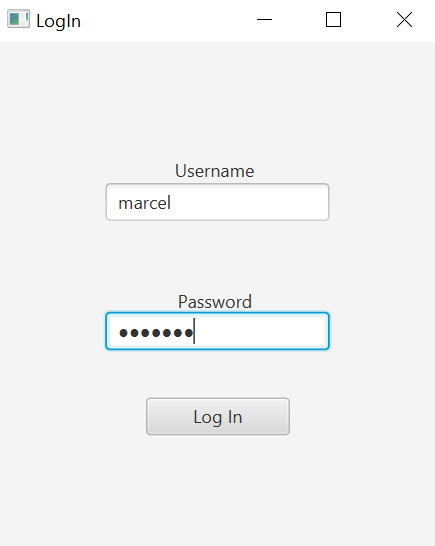
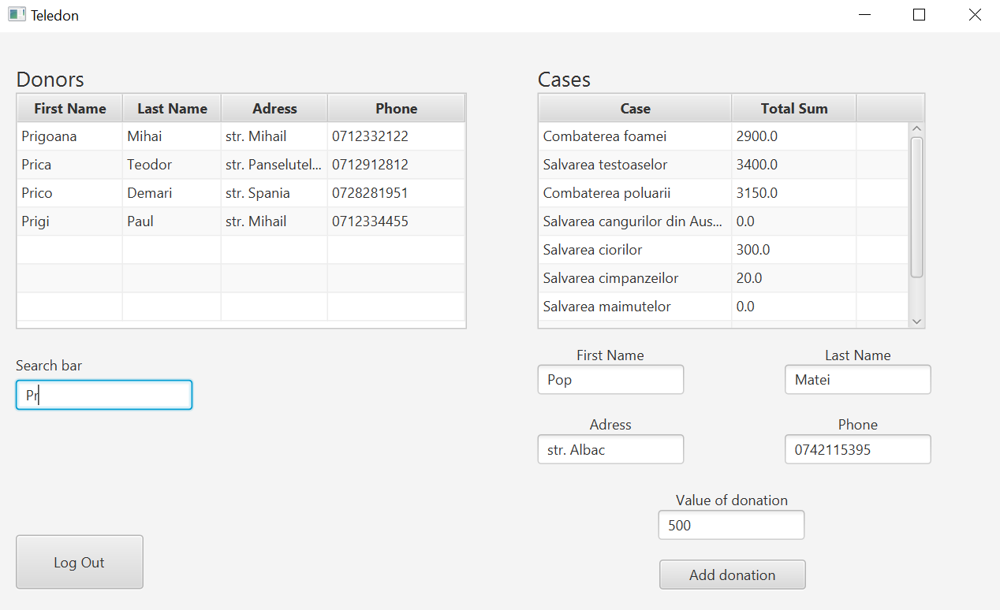

# Teledon App - Proiect pentru facultate

## Obiective
Crearea unei aplicatii in care sa fie gestionate donatiile oamenilor de catre niste voluntari. Acestia vor putea sa vada in timp real donatiile adaugate de restul voluntarilor.

## Ideea de baza
Este o aplicatie dezvoltata in Java fiind impartita pe mai multe module printre care pot fi numarate serverul, dezvoltat cu ajutorul Spring Remoting (varianta veche fiind o implementare proprie de server RPC), folosind drept baza de date SQLite si de asemenea ORM-ul Hibernate. Pe partea de client a fost folosit pentru interfata grafica JavaFX. De asemenea aplicatia are si un observer distribuit prin care clientii sunt notificati intre ei de fiecare data cand apare o noua schimbare in interfata grafica.

La pornirea aplicatiei, utilizatorul va fi nevoit sa se logheze prin intermediul ferestrei de Login.

Dupa ce acesta se logheaza cu succes, este mutat pe fereastra principala unde poate gestiona donatii, aparandu-i in timp real donatiile adaugate de catre alti clienti.

